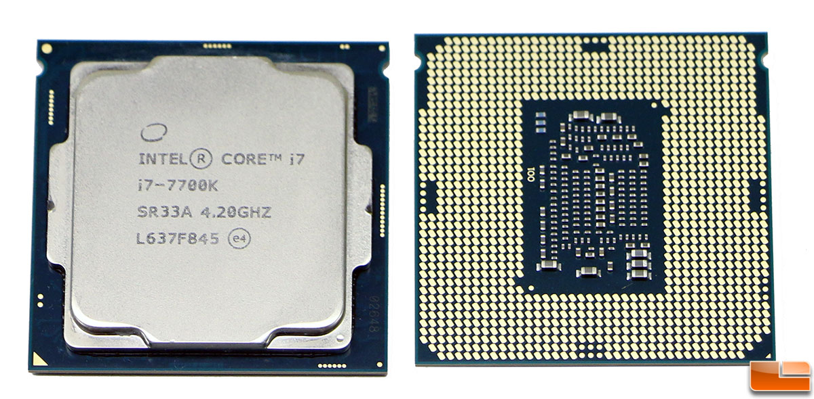
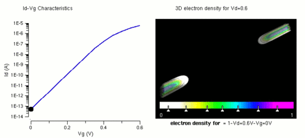
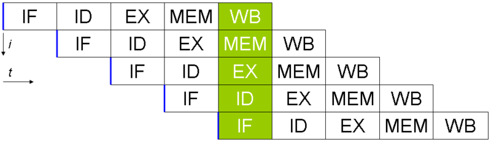
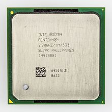
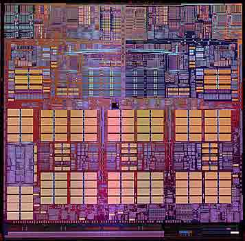
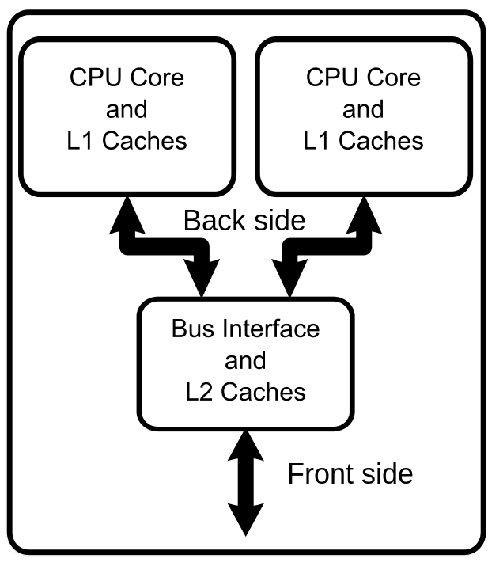
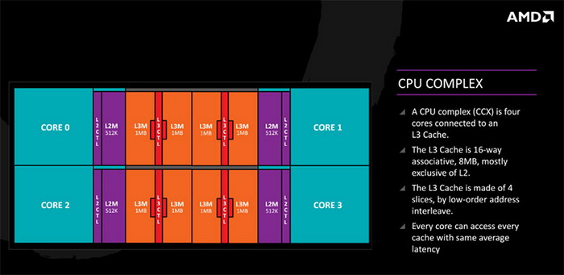
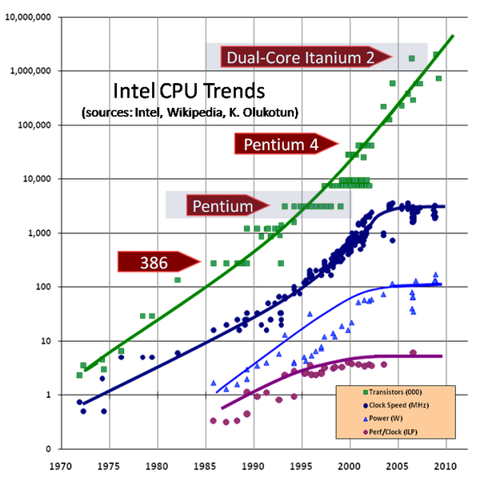

title: 多核处理器的发展
speaker: zero马达
transition: slide3
files: _js_demo.js, _css_demo.css
theme: light
- - - -
[slide]

# 提高CPU的性能的方法

### 陈达/黄锐聪

- - - -
[slide]

在摩尔定律还适用的时候(包括现在),提高芯片的性能有如下方法：
	1. 在有限面积内加入更多的场效应管(缩小器件)
	2. 提高时钟频率
	3. 增加流水线长度
	4. 多核心
	5. 优化指令集
- - - -
[slide]

首先看缩小器件这个 
理论上我们可以把器件越缩越小,实际上受限于两个因素： 
1. 制作工艺 
2. 分子大小

- - - -
[slide]

首先来看制作工艺的问题 
硅原子的晶格常数是5.431A,也即0.54nm 
而现在Intel i7的制程已经达到14nm了 
我们的器件已经递减到跟原子/分子一个数量级了! 
制作工艺其实不是问题.其实现在ibm已经是原子级别了, 

- - - -
[slide]

###  缩小器件导致的电压降低
每次器件缩小就会导致工作电压降低 
这主要是由于小器件更容易被击穿导致的. 
本来场效应管是用作开关的, 结果现在突然发现,  
由于工作电压太低, 这个开关打不开了

> 计算机仿真展现的纳米线MOSFET中反型沟道的形成（电子密度的变化）。阈值电压在0.45V左右

- - - -

[slide]
#再来看时钟频率问题
时钟的上限更明显! 
当电路超过10GHz工作的时候 
时钟的能量损耗特别大 
而且是呈二次方～ 四次方的增大。 
**这个时候整个芯片变成了一根天线。 向周围辐射能量** 
**cpu开始疯狂发热, 功耗也不断上升**

- - - -
[slide]
# 增加流水线长度

我们也可以通过降低每个时钟周期的处理能力 
通过拆分每一条指令,变为多个较短的指令, 
缩短指令的时钟周期,增加流水线的长度 
使得处理器能够以更高的时钟速度工作 

> RISC机器的五层流水线示意图（IF：读取指令，ID：指令解码，EX：运行，MEM：存储器访问，WB：写回寄存器）
- - - -

[slide]

**优点**

* 减少了处理器执行指令所需要的时钟频率周期，在通常情况下增加了指令的输入频率。
* 一些集成电路），例如加法器或者乘法器，通过添加更多的环路使其工作得更快。如果以流水线替代，能相对地减少环路。
- - - - 

[slide]

**缺点**
* 非流水线的处理器每次只运行一个指令。防止分支延时（事实上，每个分支都会产生延时）和串行指令被并行运行产生的问题。设计比较简单和较低生产成本。
* 在运行相同的指令时，非流水线处理器的指令传输延迟时间比流水线处理器明显较短。这是因为流水线的处理器必须在数据路径中添加额外触发器。
* 太长的流水线可能造成的冒险机制会变得更复杂，所以“CPU流水线设计的级越长，完成一条指令的速度就越快”不过说的是理想或者近似理想的情况

- - - -

[slide]

> 有令人惊奇的31级流水线的Pentium 4 NetBurst微架构处理器,拥有3.5GHz, 却因流水线过长而导致高频低能

- - - -

[slide]

# 多核心处理器

##既然单核cpu功耗吃不消(主要是发热), 时钟也会受到限制,那我们靠着制作工艺把核心缩小, 将多个核心塞进芯片里

> 最早的商用多核微处理器是 IBM POWER4

- - - -
[slide]

> 双核CPU的架构
- - - -

[slide]

> AMD的Zen架构

- - - -
[slide]
# 指令集优化
随着科技的进步，不断的有新指令集被加入到cpu中去。 
之前某个很复杂的运算，说不定在新指令集中一条指令就搞定了， 大大提高了效率，ok，这是一件很好的事情
- - - -
[slide]

## MMX指令集

* MMX（Multi Media eXtension，多媒體擴展指令集）指令集是Intel公司于1996年推出的一項多媒體指令增強技術。MMX指令集中包括有57條多媒體指令，通過這些指令可以一次處理多個數據，以得到更高的性能。

## SSE指令集

* SSE指令集包括了70條指令，其中包含提高3D圖形運算效率的50條SIMD（單指令多數據技術）浮點運算指令、12條MMX 整數運算增強指令、8條優化內存中連續數據塊傳輸指令。理論上這些指令對目前流行的圖像處理、浮點運算、3D運算、視頻處理、音頻處理等諸多多媒體應用起到全面強化的作用

- - - -
[slide]

## 最后,通过增加核心是现在CPU主要的提升性能的方式
2005年以来,计算机计算能力的增长已经不依赖CPU主频的增长,而是依赖CPU核数的增多

图中深蓝色的曲线是时钟周期的增长,可以看到从2005年前已经趋于平缓
- - - -
[slide]

##hello